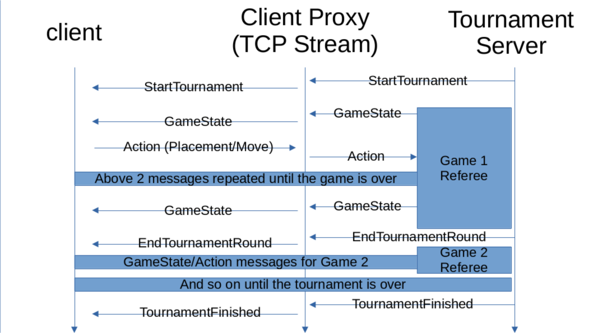

# Interaction Diagrams

### Signup Phase

The signup phase will be the first phase of the protocol. All signup messages must
occur before any tournament messages are sent.

### Tournament Phase

After signup is finished comes the tournament phase:



# Describes the first section with English prose

Remote clients will interact with the Fish.com server through a dedicated
TCP Stream for that client. All messages sent through the stream will be in
JSON and must conform to one of the formats below. Failure on the clients part
to follow any of the rules on sending messages will result in that client being
kicked by the referee of a particular game (and the tournament as a whole - if
the player is in one).

Components of Fish.com server:

- Signup (These messages are only valid during signup phase before a tournament)
    - Client -> Server messages:
        - Register client:
            - Sent to a server when a client requests to be added to a torunament.
              The server will send a registration status message in response. It is
              assumed that clients who are successfully registered will be ready to
              begin the tournament at any point.

              ```json
              {
                  "type": "RegisterClient",
              }

        - Remove self from tournament:
            - Removes this client from the tournament, whether they are in the tournament or
              in the waitlist. The server will send a client removed response message.

              ```json
              {
                  "type": "RemoveSelfFromTournament",
              }

    - Server -> Client messages:
        - Registration status:
            - Sent to a client after a request is sent to register the client
              for a tournament. This message will tell the client that they
              have been sucessfully signed up for a tournament, or they are in
              a wait list for the tournament. If the client is already in the
              tournament, the client is not added again, and a status of
              `"AlreadyJoined"` is returned.
              
              It is assumed that clients who are successfully registered will be
              ready to begin the tournament at any point.

              ```json
              {
                  "type": "RegistrationStatus",
                  "status": "Success" | "Waitlist" | "AlreadyJoined" 
              }

        - Client removed:
            - Sent to a client after the client requests to be removed from the tournament.
              If the client is not in the game, then `"NotFound"` is returned as the result.
              Otherwise, success is returned, and the player is removed from the tournament.

              ```json
              {
                  "type": "ClientRemoved",
                  "result": "Success" | "NotFound"
              }

- Tournament (tournament wide messages - only sent by the server to each client,
  clients may not send messages to the tournament manager)
  - Server -> Client messages
    - Start tournament:
      - Sends a "start tournament" message to all clients letting them know a
        tournament has started. Assigns each client a PlayerId that is unique
        across all the players in the tournament. This PlayerId will be used
        to identify the player across all games of Fish played in the tournament.

        ```json
        {
            "type": "StartTournament",
            "assigned_player_id": number,
        }
        ```

    - End tournament round:
      - Informs every client in the tournament that the current tournament round
        has ended and whether that client has advanced onto the next round or not.
        This is sent after all tournament rounds except the last round when a
        TournamentFinished message is sent and no players advance.

        ```json
        {
            "type": "EndTournamentRound",
            "does_client_advance": boolean,
        }
        ```

    - Tournament finished:
        - Notifies each client when a tournament is finished. Will contain a list of assigned player
          IDs denoting the winner(s) of the tournament. This message will be sent to all clients who
          are still active (i.e. they were not kicked from the tournament). Winners that fail to accept
          this message will be counted as players who lost the game. The message will not be resent in
          this case, though the tournament manager will internally report these winners who became
          losers via the return value of `run_tournament`.

          ```json
          {
              "type": "TournamentFinished",
              "winners": [number, ...] // This number corresponds to the "assigned_player_id"
                                       // field given at the start of a tournament
          }

- Referee (messages valid during a single game of fish)
  - These messages are part of the tournament phase though they correspond to a single
    game of fish within the tournament rather than the tournament as a whole.

  - See the "Possible Player->Server Messages" and "Possible Server->Player Messages"
    sections of player-protocol.md for the full range of all
    Referee->Client and Client->Referee messages. All of these messages are only valid
    in a game of fish. Sending a message that is invalid in any way (according to the
    json format given in player-protocol.md or the rules of fish in the same file) will
    cause the player to be kicked from the game and the tournament as a whole.
