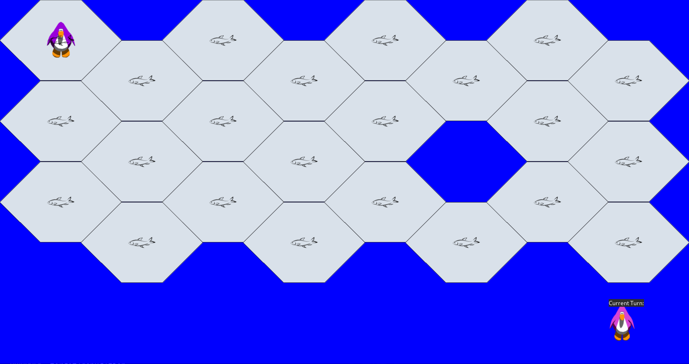

# Fish Game

## Directories

### Common
Contains all code and technical resources for the project. Includes 
source code, Rust configuration and package management files, and images
used in the GUI.

#### Common/assets
Contains all non-code data used by the program. As of 10/8/2020,
contains only images.

#### Common/src
Contains all source code for the Fish game. Rust source files have
module-level comments describing the purpose of the file.
- `Common/src/client`: contains visualization code used to show the state of
    a game in a GUI
- `Common/src/common`: contains game model and business logic code, used by both
    client and server

### Planning
Contains all documents related to planning and execution of the project,
including but not limited to milestones, system design, and speculative
features.

## Project Roadmap and Design

The project has a few key components. As of today 10/8/2020,
many of these pieces are unimplemented. They are listed below:

1. Game Model
    - Contains the business logic for the game,
    as well as data representations of its components,
    like boards and players
    - Located in `Common/src/common`
2. "Referee" game server
    - Creates and oversees a single game, managing
    interactions between the connected players and
    the board
    - Validates player moves, removing players
    who violate the rules
    - Communicates game-end information to listening parties,
    such as players and the tournament server
3. Interface for connecting to and playing games
    - A spec that allows players to connect to Referee servers,
    view the state of the game, and and make moves/penguin 
    placements depending on the state of the game
    - More information in `Planning/game-state.md`
4. In-house Player software to test interface
    - Player which is either AI or controllable by the developers
    to test the Referee and its interface
5. Tournament Server
    - Server which manages Referee servers to organize
    a tournament in which players compete for a prize
    - Collects player sign-ups for a tournament,
    creates a bracket of these players, and delegates their
    information to a series of Referee servers to run games
    - Collects game-end information from Referees and directs
    winners to subsequent bracket games
    - Communicates information about the state of the tournament,
    including winners, advancers, knocked-out players, etc.

## Running Unit Tests
To run all unit tests, run `./run_tests.sh`.
To run a specific unit test function, run `./run_tests.sh <name_of_function>`
To run a specific module's unit tests, run `./run_tests.sh <name_of_module>`
